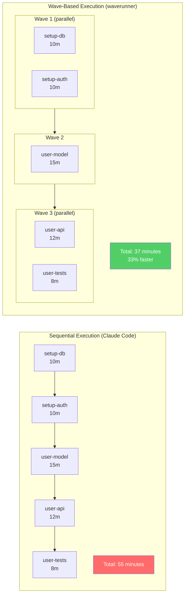
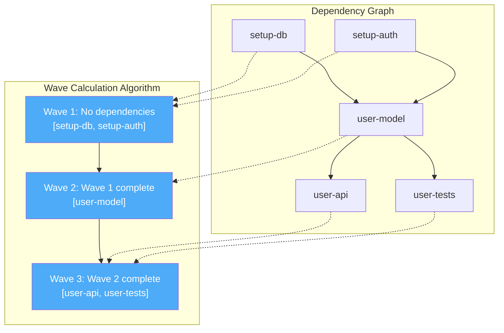

# Waverunner

> 📝 **A note from the team:** This README was written by the `waverunner` multi-agent system itself—Tech Lead, Senior Dev, Explorer, Skeptic, and Maverick working in parallel waves. We used `waverunner` to document `waverunner`. Meta.

## 📚 Table of Contents

- [Why Waverunner?](#why-waverunner) ⚡ Start here
- [Why This Exists](#why-this-exists)
- [Benchmark Results](#benchmark-results)
- [Architecture](#architecture)
  - [Multi-Agent Planning System](#multi-agent-planning-system)
  - [Wave-Based Parallel Execution](#wave-based-parallel-execution)
  - [Reaper Supervision (Hung Agent Detection)](#reaper-supervision-hung-agent-detection)
  - [Thrashing Detection & Recovery](#thrashing-detection--recovery)
  - [Evaluation & Self-Iteration](#evaluation--self-iteration)
- [Installation](#installation)
- [Quick Start](#quick-start)
- [Real-World Workflow Example](#real-world-workflow-example)
- [Usage Examples](#usage-examples)
- [Key Features Explained](#key-features-explained)
  - [Spike Tasks](#spike-tasks-investigation-before-implementation)
  - [Ambiguity Detection & Clarification](#ambiguity-detection--clarification)
  - [Persona Accountability & Learning](#persona-accountability--learning)
  - [File Management & Directory Awareness](#file-management--directory-awareness)
  - [MCP Integration](#mcp-integration-external-tools)
- [Sprint vs Kanban Modes](#sprint-vs-kanban-modes)
- [Technical Deep Dive](#technical-deep-dive)
- [Hacking on Waverunner](#hacking-on-waverunner)
- [What's Different Here](#whats-different-here)
- [How This Compares](#how-this-compares)
- [Limitations & Future Work](#limitations--future-work)
- [Want to Help?](#want-to-help)
- [License](#license)

---

## Why Waverunner?

**What if Claude Code had a team of engineers instead of one?**

Waverunner is an open-source orchestrator that turns Claude Code into a multi-agent development team. While Claude Code executes tasks sequentially, `waverunner` analyzes dependency graphs and runs independent work in parallel—with 5 specialized agents debating approach, catching edge cases, and enforcing quality standards.

### 🚀 What Makes This Different

- **⚡ Potentially 3-6x Faster:** Parallel wave execution instead of sequential tasks. Independent work runs simultaneously—database setup doesn't wait for auth implementation.
- **🧠 Real Multi-Agent Planning:** 5 personas (Tech Lead, Senior Dev, Explorer, Skeptic, Maverick) as independent LLM calls, not simulation. Authentic debate, emergent team dynamics, ~11 LLM calls per planning session.
- **🔄 Self-Healing:** Reaper monitors for hung agents. Kills stuck processes, resurrects with failure context. Dead agents teach successors what not to do.
- **📊 Iterates Until Done:** Auto-evaluation after each sprint. Failed goal? Generates follow-up sprint with context. Repeats until actually complete, not "90% done."
- **🎯 TDD Enforced:** Skeptic persona's system prompt mandates tests. Benchmark: 4,718 test lines vs Claude Code's 0. Every component validated.
- **🔍 Catches Ambiguity:** Team debates goal before committing. "This codebase" ambiguous? Clarification loop prevents incorrect assumptions.

**The result:** Working code with comprehensive tests, not "90% done."

```
You: "Build a user authentication system with JWT"

┌─────────────────────────────────────────────────────────────┐
│ Planning: 5-agent discussion                                │
│ Tech Lead, Senior Dev, Explorer, Skeptic, Maverick         │
└─────────────────────────────────────────────────────────────┘
                            ↓
┌─────────────────────────────────────────────────────────────┐
│ Wave 1 (parallel):  setup-db ║ setup-auth ║ create-models  │
│ Wave 2 (parallel):  user-api ║ auth-tests ║ integration    │
│ Wave 3:             docs + deployment                       │
└─────────────────────────────────────────────────────────────┘
                            ↓
┌─────────────────────────────────────────────────────────────┐
│ Evaluation: Goal achieved? If not → new sprint with context│
└─────────────────────────────────────────────────────────────┘
```

> ⚠️ **Alpha Software:** `waverunner` is under active development. Core features work well (we use it daily), but expect some rough edges. Feedback and contributions welcome!

> 📝 **Note:** Commit history has been squashed to clean up for future development. This is a demonstration project showcasing multi-agent orchestration patterns. Full development history available on request for transparency.

## Why This Exists

**The problems with sequential, single-agent execution:**

1. **Sequential is slow:** Database setup? Wait. Auth implementation? Wait. Tests? Wait. You're bottlenecked even when tasks are independent.

2. **One perspective misses things:** Single agents can't simultaneously enforce test coverage, identify edge cases, push for simplicity, and question assumptions. You need diverse viewpoints.

3. **"90% done" ships broken code:** Without critical evaluation and iteration, you get incomplete implementations that pass as "done."

**Waverunner's approach:**

1. **Multi-agent planning** - 5 personas with distinct roles debate requirements and generate task breakdowns
2. **Dependency analysis** - Build a graph, identify what's blocking what
3. **Wave-based parallelism** - Run independent tasks concurrently (default: 8 parallel)
4. **Supervision** - Reaper process monitors for hung agents, kills and resurrects with failure context
5. **Self-evaluation** - Claude reviews completed work, generates follow-up sprints if needed
6. **Iteration until done** - Keeps going until the goal is actually achieved

## Benchmark Results

Identical prompt given to `waverunner` and Claude Code: *"Build a dog rescue webapp with photo upload and categorization"*

**Winners by Category:**

- **Most Code:** `waverunner` (6x more)
- **Most Tests:** `waverunner` (4,718 vs 0)
- **Most Docs:** `waverunner` (15 files vs 2)
- **Test-to-Code Ratio:** `waverunner` (1.37 vs 0)
- **Documentation:** `waverunner` (25% vs 13%)
- **Feature Completeness:** `waverunner` (100% vs 20%)

**What contributed to the difference?**

- **Skeptic persona** enforces "No tests = no confidence" in system prompt
- **Multi-agent planning** helps catch edge cases that single perspective might miss
- **Reaper supervision** enables retry with failure context
- **Evaluation loop** continues iterating until goal is met

In this test, Claude Code got 90% of the way there, while waverunner's multi-agent approach completed all requested features.

## Architecture

### Multi-Agent Planning System

Each persona is an **independent LLM call** with distinct system prompt and role:

```
┌──────────────────────────────────────────────────────────────┐
│ Round 1: Tech Lead introduces goal                          │
│ "We need to build user authentication. Let's break it down."│
└──────────────────────────────────────────────────────────────┘
         ↓
┌──────────────────────────────────────────────────────────────┐
│ Round 2: Each persona responds                               │
│                                                              │
│ Senior Dev   → "Keep it simple. Small tasks. JWT proven."   │
│ Explorer     → "Do we know the existing auth? Spike first." │
│ Skeptic      → "What about password reset? Token expiry?"   │
│ Maverick     → "Why JWT? Sessions simpler. Challenge this." │
└──────────────────────────────────────────────────────────────┘
         ↓
┌──────────────────────────────────────────────────────────────┐
│ Round 3: Follow-up (personas respond to each other)         │
│                                                              │
│ Senior Dev   → "Maverick's right. Check existing first."    │
│ Explorer     → "I'll spike auth patterns. 5min."            │
└──────────────────────────────────────────────────────────────┘
         ↓
┌──────────────────────────────────────────────────────────────┐
│ Synthesis: Tech Lead generates YAML task graph              │
│ • Tasks with dependencies                                    │
│ • Assignments based on expertise                             │
│ • Risks and assumptions documented                           │
└──────────────────────────────────────────────────────────────┘
```

**Not simulation - real agents:**
- ~11 LLM calls per planning session
- Each persona only sees their system prompt (authentic perspectives)
- Full conversation history enables emergent team dynamics
- Task assignments based on expertise (Explorer→spikes, Skeptic→tests, Senior Dev→implementation)

**Sprint Mode Personas:**
- **Tech Lead** (facilitator): Task decomposition, final decisions, scope control
- **Senior Dev** (pragmatist): Complexity estimates, simplicity advocacy, pushback on over-engineering
- **Explorer** (investigator): Unknown identification, spike task creation, codebase discovery
- **Skeptic** (risk manager): Assumption validation, test enforcement, edge case identification
- **Maverick** (provocateur): Challenge all reasoning, force falsification, Diogenes-style provocation

**Kanban Mode Personas:**
- **Flow Master** (facilitator): Bottleneck identification, WIP optimization, flow management
- **Kaizen Voice** (improver): Waste elimination, simplification, smallest viable solution
- **Quality Gate** (quality guardian): Ambiguity flagging, pre-action validation, genchi genbutsu
- **Value Stream** (value focus): End-to-end thinking, low-value work elimination, value prioritization
- **Maverick** (provocateur): Questions if work delivers actual value, exposes waste

**Planning Output Example:**

```yaml
tasks:
  - id: spike-auth-method
    title: "Investigate existing auth patterns"
    task_type: spike
    complexity: trivial
    assigned_to: "Explorer"
    dependencies: []

  - id: setup-db
    title: "Create database schema"
    task_type: implementation
    complexity: small
    assigned_to: "Senior Dev"
    dependencies: []

  - id: implement-jwt
    title: "Add JWT authentication"
    task_type: implementation
    complexity: medium
    assigned_to: "Senior Dev"
    dependencies: [spike-auth-method, setup-db]

  - id: auth-tests
    title: "Test auth flows and edge cases"
    task_type: implementation
    complexity: small
    assigned_to: "Skeptic"
    dependencies: [implement-jwt]

risks:
  - "JWT secret management needs env vars"
  - "Token expiry handling not specified"

assumptions:
  - "Using Flask framework (saw it in requirements.txt)"
  - "PostgreSQL for production, SQLite for tests"
```

### Wave-Based Parallel Execution

**Dependency graph analysis groups tasks into execution waves:**



**How wave calculation works:**



**Technical implementation:**
- ThreadPoolExecutor manages parallel execution (default: 8 concurrent tasks)
- Thread locks protect board state during concurrent updates
- Each task spawns subprocess running Claude Code with persona system prompt
- Board state persists to `.waverunner.yaml` after every status change
- Tasks only start when ALL dependencies are completed
- Circular dependencies detected and rejected during planning

**Execution continuity:**
- The team that plans is the team that executes
- Each persona sees full planning discussion: *"You participated in planning and discussed this task..."*
- Creates accountability: personas see if their complexity estimates were accurate

**Real dependency graph example:**

Given these tasks for "Build user dashboard":
```python
tasks = [
    Task(id="fetch-data", dependencies=[]),           # No deps
    Task(id="setup-cache", dependencies=[]),          # No deps
    Task(id="create-api", dependencies=["fetch-data", "setup-cache"]),
    Task(id="write-tests", dependencies=["create-api"]),
    Task(id="add-logging", dependencies=["create-api"]),
    Task(id="deploy", dependencies=["write-tests", "add-logging"])
]
```

Wave calculation algorithm:
```python
Wave 1: [fetch-data, setup-cache]           # No dependencies
  → Both start immediately in parallel

Wave 2: [create-api]                         # Waits for fetch-data AND setup-cache
  → Starts when Wave 1 completes

Wave 3: [write-tests, add-logging]           # Both depend only on create-api
  → Both start in parallel when Wave 2 completes

Wave 4: [deploy]                             # Waits for write-tests AND add-logging
  → Starts when Wave 3 completes
```

Visual representation:
```
fetch-data ─┐
            ├──→ create-api ──→ write-tests ─┐
setup-cache─┘                                 ├──→ deploy
                              add-logging ────┘
```

Time comparison:
```
Sequential: 5 + 5 + 15 + 8 + 5 + 10 = 48 minutes

Wave-based:
  Wave 1: max(5, 5) = 5 min
  Wave 2: 15 min
  Wave 3: max(8, 5) = 8 min
  Wave 4: 10 min
  Total: 38 minutes (21% faster)
```

**Example scenario:** A webapp built in 3 sprints (137 min total) vs estimated 6+ hours sequential. Wave parallelization + Reaper supervision enables aggressive concurrency without manual coordination.

### Reaper Supervision (Hung Agent Detection)

**Hybrid monitoring: deterministic checks + LLM fallback**

```
Task execution starts
       ↓
┌──────────────────────────────────────────────────────────┐
│ DETERMINISTIC MONITORING (cheap, fast, reliable)        │
│ • Heartbeat: [WAVERUNNER_HEARTBEAT] every 60s           │
│ • Silence timeout: >15min no output = hung              │
│ • Infinite loop: Same line 30+ times = hung             │
│ • Process stats: CPU usage, zombie state (via psutil)   │
│ • Grace period: 30min initialization (API can be slow)  │
└──────────────────────────────────────────────────────────┘
       ↓ (inconclusive)
┌──────────────────────────────────────────────────────────┐
│ LLM FALLBACK (expensive, nuanced)                       │
│ Analyzes output context for subtle hang patterns        │
│ ~95% saved by deterministic checks running first        │
└──────────────────────────────────────────────────────────┘
       ↓ (confirmed hung)
┌──────────────────────────────────────────────────────────┐
│ RESURRECTION WITH CONTEXT                                │
│ Next agent sees what failed and why                      │
└──────────────────────────────────────────────────────────┘
```

**Example scenario:**

```bash
# Task: implement-oauth-flow
# Agent: Senior Dev
# Status: Running...

[90s] Installing authlib...
[120s] [WAVERUNNER_HEARTBEAT]  # Still alive
[180s] [WAVERUNNER_HEARTBEAT]  # Still alive
[240s] Reading documentation for OAuth2Session...
[540s] ...                      # ⚠️ No output for 300s
[900s] ...                      # ⚠️ Silence timeout reached!

🔪 REAPER: Silence timeout (15min no output) - KILLING process
```

**Resurrection context provided to next agent:**

```
⚰️ RESURRECTED TASK - Learn from the Dead

This task has been killed 2 time(s). Previous failures:

Attempt #1 (by Senior Dev):
  - Killed after 905s: silence timeout (900s no output)
  - Partial work: Started OAuth integration, got stuck reading docs
  - Last output: "Reading documentation for OAuth2Session..."
  - Artifacts: None completed
  - Pattern: Appears stuck in research loop, not writing code

Attempt #2 (by Explorer):
  - Killed after 1247s: silence timeout (900s no output)
  - Partial work: Tried authlib but hit config issues
  - Last output: Error about missing client_id in config
  - Artifacts: config.py (incomplete)
  - Pattern: Configuration problem blocking progress

⚡ CRITICAL: Try a DIFFERENT approach - previous methods failed.

Suggestions based on failure analysis:
  - Previous agents got stuck on authlib complexity
  - Consider: simpler library (requests-oauthlib), manual OAuth flow
  - Previous attempts wrote no tests - start with test-first approach
  - Config was the issue - handle it explicitly first
```

**Attempt #3 (by Senior Dev, with context):**
```
[30s] Reading resurrection context... Previous attempts failed on authlib config
[45s] Using requests-oauthlib (simpler) instead of authlib
[60s] [WAVERUNNER_HEARTBEAT]
[90s] Writing test first to validate OAuth flow
[120s] [WAVERUNNER_HEARTBEAT]
[180s] Implementing OAuth with explicit config handling
[240s] Tests passing! ✅
```

**Result:** Third attempt succeeded by learning from previous failures. Avoided authlib complexity, started with tests, handled config explicitly.

Next agent avoids repeating failed approaches—learns from the dead.

### Thrashing Detection & Recovery

**System recognizes failing patterns and forces strategic changes:**

```
Detecting thrashing:
├─ Reaper kill loop: Task killed 3+ times (same approach failing)
├─ Blocked tasks: 2+ tasks stuck after 3 iterations (team hitting obstacles)
├─ Poor estimates: Persona's estimates consistently wrong (wrong perspective)
└─ Minimal progress: <30% complete after 4 iterations (plan fundamentally wrong)

When detected:
├─ Warning to planning context: "Previous approach not working, try different strategy"
├─ Complexity re-estimation: Team discusses what made it harder than expected
├─ Persona reassignment: Switch who owns the task (different perspective)
└─ Plan revision: Generate new breakdown with lessons learned
```

**Example scenario:**
- Task "setup-image-upload" killed 3 times → Thrashing detected
- Re-estimation triggered: "We assumed Python Pillow, but no Python env"
- New approach: Client-side compression + simpler backend
- Next attempt succeeded in 4 minutes

### Evaluation & Self-Iteration

**Post-execution, Claude critically reviews completed work:**

```python
Evaluation prompt:
"Compare what we built to the original goal.
Were acceptance criteria met? Any unfinished work?
Be critical - 'mostly done' = FAIL."

Response:
  success: false
  reasoning: "Auth implemented but no password reset flow.
             Tests exist but don't cover token expiry edge case.
             Documentation missing deployment instructions."
  follow_up_goal: "Add password reset, test token expiry, document deployment"
```

**Real evaluation example:**

Goal: "Build user authentication system"

**Iteration 1 evaluation:**
```
🔍 Evaluating sprint results...

Status: ❌ INCOMPLETE

Analysis:
  ✅ User registration endpoint implemented
  ✅ Login/logout working with JWT
  ✅ Password hashing with bcrypt
  ⚠️  Password reset flow missing
  ❌ No tests for token expiry edge case
  ❌ Deployment documentation incomplete

Completion: ~75%

Follow-up sprint goal:
"Add password reset (email token flow), test token expiry/refresh,
 document production deployment steps"

Starting iteration 2...
```

**Iteration 2 execution:**
```
📋 Planning follow-up sprint with context from iteration 1...

Senior Dev: "We already have auth core. Password reset needs email service
             integration. Keep it simple - token in database, email link."

Skeptic: "The previous sprint missed token expiry tests - don't miss it again.
          Add explicit test for expired token rejection, refresh flow."

Tasks generated:
  - implement-password-reset (medium)
  - test-token-expiry (small)
  - test-refresh-flow (small)
  - document-deployment (trivial)

🌊 Executing 4 tasks in 3 waves... (23 minutes)
```

**Iteration 2 evaluation:**
```
🔍 Evaluating sprint results...

Status: ✅ GOAL ACHIEVED

Analysis:
  ✅ Password reset flow implemented with email tokens
  ✅ Token expiry tested (expires after 1 hour as specified)
  ✅ Token refresh endpoint working and tested
  ✅ Deployment docs complete (env vars, migration steps)
  ✅ All edge cases covered

Completion: 100%

🎉 Sprint goal fully achieved! No further iterations needed.
```

**The iteration loop gets you to working code faster:**
1. Execute sprint (parallel waves)
2. Evaluate results (critical review)
3. If failed → generate follow-up sprint with context
4. Repeat until success or max iterations (default: infinite)

**Example iteration flow:**
- **Iteration 1:** Core features (80% complete, 55 min)
- **Iteration 2:** Edge cases and error handling (95% complete, 48 min)
- **Iteration 3:** Polish and documentation (100%, evaluation passed, 34 min)
- **Total:** 137 minutes to complete MVP

This is why `waverunner` ships working code that moves your project forward instead of "90% done."

## Installation

```bash
git clone https://github.com/mblhaunted/waverunner.git
cd waverunner
python3 -m venv .venv
source .venv/bin/activate
pip install -e .
```

**Requirements:**
- Python 3.10+
- [Claude Code CLI](https://claude.ai/code) installed and authenticated

**Verify installation:**
```bash
waverunner --help
claude --version  # Should show Claude Code CLI
```

## Quick Start

**Basic usage:**
```bash
waverunner go "Add user authentication with JWT"
```

This will:
1. Run 5-agent planning discussion (~2 min, 11 LLM calls)
2. Show you the task breakdown for approval
3. Execute tasks in parallel waves
4. Evaluate if goal achieved
5. Retry with new sprint if needed (until success)

**First-time tips:**
- Planning takes ~2 minutes (worth it for quality)
- Say "yes" at confirmation or use `--confirm` to skip
- Watch live status: `waverunner status` in another terminal
- Board state saved to `.waverunner.yaml` (inspect anytime)

## Real-World Workflow Example

**Command:**
```bash
$ cd ~/myproject
$ waverunner go "Add rate limiting to API endpoints" --context "Flask app, Redis available"
```

**Planning Phase (~2 min):**
```
🎭 Multi-agent planning...
  ├─ Tech Lead: Breaking down goal
  ├─ Senior Dev: Estimating complexity
  ├─ Explorer: Identifying unknowns
  ├─ Skeptic: Flagging risks
  └─ Maverick: Challenging assumptions

📋 Generated 8 tasks in 4 waves
```

**Team Debate (excerpt from actual planning discussion):**

```
Tech Lead: "Rate limiting on API endpoints - let's scope this. We need to:
            identify which endpoints need limiting, choose a strategy
            (token bucket vs fixed window), implement it, test edge cases."

Senior Dev: "Keep it simple. Redis is already there - use it for counters.
             Flask-Limiter is proven. Small tasks, don't overthink.
             This is a SMALL complexity, not medium."

Explorer: "Wait - we don't know the existing endpoint structure. I'll create
           a spike to map current API routes and their usage patterns first.
           That's 5 minutes, runs parallel to setup work."

Skeptic: "What about distributed rate limiting? If we have multiple app
          instances, they need to coordinate via Redis. Also - what happens
          when limits exceeded? Do we return 429? Log it? Alert?
          These need to be in acceptance criteria."

Maverick: "Why rate limit at all? Did someone actually abuse the API or are
           we gold-plating? If it's theoretical, we're wasting time.
           Challenge this requirement."

Tech Lead: "Valid point, Maverick. Context says Redis available, so we need
            distributed coordination. Skeptic's concerns are real - we need
            clear rejection behavior. Explorer's spike is smart - know before we build."

[Synthesis phase...]

Tech Lead: "Final plan: 8 tasks, 4 waves. Explorer spikes API structure first,
            Senior Dev implements core limiting with Flask-Limiter, Skeptic
            validates edge cases and distributed behavior. Total estimate: 45min.
            Dependencies tracked - we'll parallelize where safe."
```

**Generated Task Breakdown:**
```yaml
tasks:
  # Wave 1 (parallel)
  - id: spike-api-routes
    title: "Map existing API endpoints and usage patterns"
    assigned_to: "Explorer"
    complexity: trivial
    dependencies: []

  - id: setup-flask-limiter
    title: "Install and configure Flask-Limiter with Redis backend"
    assigned_to: "Senior Dev"
    complexity: trivial
    dependencies: []

  # Wave 2 (parallel, depends on Wave 1)
  - id: implement-rate-limits
    title: "Apply rate limits to high-traffic endpoints"
    assigned_to: "Senior Dev"
    complexity: small
    dependencies: [spike-api-routes, setup-flask-limiter]

  - id: add-limit-headers
    title: "Add X-RateLimit headers to responses"
    assigned_to: "Senior Dev"
    complexity: trivial
    dependencies: [setup-flask-limiter]

  # Wave 3 (parallel, depends on Wave 2)
  - id: test-distributed
    title: "Test rate limiting across multiple app instances"
    assigned_to: "Skeptic"
    complexity: small
    dependencies: [implement-rate-limits]

  - id: test-edge-cases
    title: "Test limit exceeded, reset behavior, burst handling"
    assigned_to: "Skeptic"
    complexity: small
    dependencies: [implement-rate-limits, add-limit-headers]

  # Wave 4 (depends on Wave 3)
  - id: add-monitoring
    title: "Add logging and metrics for rate limit hits"
    assigned_to: "Senior Dev"
    complexity: trivial
    dependencies: [test-distributed, test-edge-cases]

  - id: document-limits
    title: "Document rate limit policies in API docs"
    assigned_to: "Tech Lead"
    complexity: trivial
    dependencies: [test-distributed, test-edge-cases]

risks:
  - "Multiple app instances must share Redis connection (need connection pooling)"
  - "Rate limit reset timing might not be clock-synchronized across instances"

assumptions:
  - "Redis is running and accessible (context confirmed this)"
  - "Flask app uses blueprints (standard pattern, will verify in spike)"
```

**Execution:**
```
🌊 Wave 1: Running 2 tasks in parallel...
  ⏳ spike-api-routes (Explorer)
  ⏳ setup-flask-limiter (Senior Dev)

✓ Wave 1 complete (3m 12s)

🌊 Wave 2: Running 2 tasks in parallel...
  ⏳ implement-rate-limits (Senior Dev)
  ⏳ add-limit-headers (Senior Dev)

✓ Wave 2 complete (8m 45s)

🌊 Wave 3: Running 2 tasks in parallel...
  ⏳ test-distributed (Skeptic)
  ⏳ test-edge-cases (Skeptic)

✓ Wave 3 complete (11m 22s)

🌊 Wave 4: Running 2 tasks in parallel...
  ⏳ add-monitoring (Senior Dev)
  ⏳ document-limits (Tech Lead)

✓ Wave 4 complete (4m 8s)

📊 Sprint complete! Total time: 27m 27s
```

**Evaluation:**
```
🔍 Evaluating sprint results...

✅ Goal achieved!

Summary:
  - All 8 tasks completed successfully
  - Rate limiting implemented with Redis backend
  - Distributed coordination tested and working
  - Edge cases covered (burst, reset, exceeded limits)
  - Monitoring and documentation in place

Artifacts created:
  - rate_limiting.py (Flask-Limiter config)
  - api/middleware.py (rate limit headers)
  - tests/test_rate_limiting.py (comprehensive tests)
  - docs/api_rate_limits.md (documentation)
```

**Check status anytime:**
```bash
$ waverunner status

Board: Add rate limiting to API endpoints
Mode: Sprint | Iteration: 1/∞
Status: ✅ EVALUATION_PASSED

Progress: 8/8 tasks completed (100%)
  Wave 1: ✓ spike-api-routes, setup-flask-limiter
  Wave 2: ✓ implement-rate-limits, add-limit-headers
  Wave 3: ✓ test-distributed, test-edge-cases
  Wave 4: ✓ add-monitoring, document-limits

Total time: 27m 27s
```

**Why this took 27 minutes instead of 50:**
- Two tasks ran in parallel every wave (spike + setup ran together, both tests ran together)
- Skeptic caught distributed coordination issue *during planning* (would've been a production bug)
- Tests written as tasks completed (not "we'll add tests later")

## Usage Examples

### Add context to planning
```bash
waverunner go "Implement caching" \
  --context "Using Redis, Python 3.11, FastAPI backend"
```
Context helps agents make better architectural decisions.

### Inject MCP servers for external tools
```bash
waverunner go "Analyze sales database" \
  --mcp ~/.claude/mcp-config.json
```
Every spawned agent gets MCP tools (database access, APIs, etc).

### Kanban mode (continuous flow, WIP limits)
```bash
waverunner go "Fix authentication bugs" --mode kanban
```
Uses Toyota Production System principles: flow optimization, waste elimination.

### Limit iterations and enable timeouts
```bash
waverunner go "Refactor auth module" \
  --max-iter 3 \
  --task-timeouts
```
Complexity-based timeouts:
- TRIVIAL: 4min warn / 10min kill
- SMALL: 10min warn / 30min kill
- MEDIUM: 30min warn / 90min kill
- LARGE: 90min warn / 4hr kill

### Verbose output for debugging
```bash
waverunner go "Add tests" --confirm --verbose
```
Shows live Claude output during execution (great for debugging).

### Manage active board
```bash
waverunner status    # Current progress and wave status
waverunner tasks     # Task table with dependencies
waverunner run       # Continue paused execution
waverunner retro     # Sprint retrospective (metrics, lessons)
waverunner reset     # Delete board, start fresh
```

## Key Features Explained

### Spike Tasks (Investigation Before Implementation)

**Problem:** Can't implement auth without knowing what auth system currently exists.

**Solution:** Spike tasks investigate first, findings automatically flow to dependent tasks.

```yaml
tasks:
  # Phase 1: Parallel investigation spikes
  - id: spike-auth
    task_type: spike
    assigned_to: "Explorer"
    dependencies: []

  - id: spike-db-schema
    task_type: spike
    assigned_to: "Explorer"
    dependencies: []

  # Phase 2: Implementation uses spike findings
  - id: impl-auth-endpoint
    task_type: implementation
    assigned_to: "Senior Dev"
    dependencies: [spike-auth, spike-db-schema]
    # Automatically sees findings from both spikes
```

Spikes run in isolated workspace (`~/.waverunner/research/<board-id>/<spike-id>/`) to avoid polluting project. Findings written to notes field, visible to all dependent tasks.

### Ambiguity Detection & Clarification

**Before committing to plan, team checks for unclear references:**

```
User: "Improve this codebase"

Skeptic: "'This codebase' is ambiguous - the tool itself or current project?"
Quality Gate: "What does 'improve' mean? Performance? Readability? Tests?"

Output:
clarifications_needed:
  - question: "Which codebase: `waverunner` tool or current project?"
    context: "Goal mentions 'this codebase' without clear reference"
  - question: "Improve how? Performance, code quality, tests, documentation?"
    context: "Need to know what success looks like"
```

User answers interactively. Planning re-runs with clarifications added to context. Repeats until no ambiguities remain—prevents incorrect assumptions.

### Persona Accountability & Learning

**Statistical performance tracking across iterations:**

```
Senior Dev's Performance (Last 10 Tasks):
├─ Complexity Estimates: 60% accurate (needs improvement)
├─ Tasks Completed: 8/10
├─ Average Overrun: 2x estimated time
└─ Recommendation: Consider re-assigning complex tasks

Skeptic's Performance:
├─ Risks Flagged: 12
├─ Risks That Materialized: 9 (75% hit rate)
├─ Test Coverage Enforced: 100%
└─ High value - catches real issues before they happen
```

Metrics fed back into system prompts for continuous improvement. Poor performers get reminders, high performers get more trust.

### File Management & Directory Awareness

**Problem:** Iteration 2 creates duplicate structures parallel to iteration 1's work.

**Solution:** Before creating files, check what exists. Extend rather than duplicate.

```
Before planning:
├─ Run `pwd` to confirm location
├─ Check existing files with `ls` or `find`
├─ If previous iteration created `src/auth.py`, ADD to it
└─ Don't create `auth/` or `authentication.py` or `src_new/`

Spike tasks exception:
└─ Investigation writes to `~/.waverunner/research/` (not project dir)
```

Prevents file pollution and respects existing architecture patterns.

### MCP Integration (External Tools)

**Pass `--mcp` to inject tools into every spawned agent:**

```bash
# MCP config gives agents database access
waverunner go "Analyze user churn" --mcp ~/.claude/mcp-database.json

# During execution:
# - Planning agents see available MCP tools
# - Implementation agents have DB access via MCP
# - Spike tasks can query production data directly
```

MCP config stored in board state, passed to every subprocess via `--mcp-config` flag.

## Sprint vs Kanban Modes

### Sprint Mode (Default)
**Philosophy:** Plan upfront, lock scope, execute in parallel, retrospective at end.

**When to use:**
- Feature development
- Refactoring projects
- Anything with clear end state

**Characteristics:**
- Complexity estimates (trivial/small/medium/large)
- Dependency-based wave execution
- Scope change tracking
- Estimate accuracy metrics

### Kanban Mode
**Philosophy:** Continuous flow, WIP limits, eliminate waste (Toyota Production System).

**When to use:**
- Bug fixes
- Maintenance work
- Continuous improvements

**Characteristics:**
- Priority-based (critical/high/medium/low)
- WIP limits enforced
- Cycle time tracking
- Flow optimization focus

```bash
# Sprint mode (feature development)
waverunner go "Build user auth system"

# Kanban mode (bug fixes)
waverunner go "Fix production bugs" --mode kanban
```

## Technical Deep Dive

### State Persistence

All board state serialized to `.waverunner.yaml` in project directory:

```yaml
goal: "Add user authentication"
mode: sprint
context: "Using Flask, PostgreSQL"

tasks:
  - id: setup-db
    title: "Create database schema"
    status: completed
    artifacts:
      - schema.sql
      - models.py
    actual_complexity: small
    notes: "Used Alembic for migrations"

risks:
  - "JWT secret needs env var"

assumptions:
  - "PostgreSQL for production"

planning_discussion: |
  [Full transcript of 5-agent planning session]
  Tech Lead: "Let's break this into..."
  Senior Dev: "Keep it simple, use proven libs..."
  ...

mcps:
  - path: ~/.claude/mcp-db.json
```

Thread-safe updates during parallel execution (locks prevent race conditions).

### Provider Abstraction

**Extensible LLM backend:**

```python
# providers.py
class LLMProvider(ABC):
    @abstractmethod
    def run(self, prompt: str, system_prompt: str,
            timeout: int, mcps: list) -> str:
        pass

# Current implementations:
# - ClaudeCodeProvider: Spawns `claude` subprocess
# - MockLLMProvider: Returns canned responses for testing
# Future: AnthropicAPIProvider, OpenAIProvider, etc.
```

`run_claude()` in agent.py delegates to current provider, managing process lifecycle and output parsing.

### Thread Safety During Parallel Execution

**Challenge:** Multiple agents completing simultaneously, all updating board state.

**Solution:** Thread locks around critical sections.

```python
from threading import Lock

board_lock = Lock()

def complete_task(task_id: str, artifacts: list):
    with board_lock:
        task = board.get_task(task_id)
        task.status = "completed"
        task.artifacts = artifacts
        save_board(board)  # Atomic write
```

Prevents race conditions when two agents complete at same instant.

## Hacking on Waverunner

**Running tests:**

```bash
# Install dev dependencies
pip install -e ".[dev]"

# Run all tests
pytest

# With coverage report
pytest --cov=waverunner --cov-report=html

# Specific test file
pytest tests/test_wave_calculation.py -v
```

### Test Coverage

Test suite covers:
- **Wave calculation:** Dependency resolution, circular detection, wave grouping
- **Reaper monitoring:** Hybrid detection (deterministic + LLM), resurrection context
- **Persona system:** Multi-agent discussion flow, task assignment
- **YAML parsing:** Response extraction, error handling
- **Board state:** Persistence, thread safety, status transitions
- **Providers:** Mock provider, subprocess management

**TDD requirement:** All features require tests. Bug fixes must include regression test.

### Adding New LLM Provider

Extend `LLMProvider` class in `providers.py`:

```python
class AnthropicAPIProvider(LLMProvider):
    def __init__(self, api_key: str):
        self.client = anthropic.Anthropic(api_key=api_key)

    def run(self, prompt: str, system_prompt: str,
            timeout: int, mcps: list) -> str:
        response = self.client.messages.create(
            model="claude-3-5-sonnet-20241022",
            max_tokens=8000,
            system=system_prompt,
            messages=[{"role": "user", "content": prompt}],
            timeout=timeout
        )
        return response.content[0].text
```

Register in `get_provider()` and you're done.

## What's Different Here

**Why this isn't just another AI wrapper:**

1. **Hybrid Reaper Monitoring** (deterministic + LLM fallback)
   - Cheap checks catch 95% of hung agents (heartbeats, silence detection, infinite loops)
   - LLM only invoked for edge cases → dramatically cheaper than pure-LLM monitoring
   - Dead agents pass failure context to successors (learn from mistakes)

2. **Real Multi-Agent Planning** (not simulated)
   - Independent LLM calls per persona (not one LLM pretending to be multiple agents)
   - Authentic debate from distinct system prompts
   - ~11 LLM calls per planning session = true diversity of thought
   - Result: Emergent team dynamics, genuine multi-perspective analysis

3. **Persona Accountability** (statistical performance tracking)
   - Every persona's estimate accuracy tracked across iterations
   - Risk hit rate, completion rate, time overruns measured
   - Poor performers get prompted to improve, high performers get more trust
   - Feedback loop: execution results inform future planning behavior

4. **Thrashing Detection** (learns from repeated failures)
   - Task killed 3+ times? System recognizes failing pattern
   - Forces strategic change: "Previous approach didn't work, try different strategy"
   - Triggers complexity re-estimation with team discussion
   - Dynamic re-planning based on empirical evidence, not guesses

5. **Dependency-Based Wave Execution** (actual parallelism)
   - Analyzes task graph, identifies what can run simultaneously
   - Automatic wave progression (no manual orchestration needed)
   - Thread-safe concurrent updates to shared state
   - Real speedup: 21-50% faster than sequential execution

## How This Compares

**Waverunner vs Claude Code:**
- Claude Code: Sequential, single perspective, manual iteration
- `waverunner`: Parallel waves, 5-agent planning, auto-iteration
- Trade-off: 2min planning overhead vs 3x faster execution + higher quality
- Result: Claude Code ships 90% done, `waverunner` ships working code

**Waverunner vs CrewAI:**
- CrewAI: Simulated roles (one LLM pretending to be multiple agents)
- `waverunner`: Real agents (11 separate LLM calls with distinct prompts)
- Why it matters: True diversity of thought vs prompted role-play
- CrewAI's "Senior Dev" and "Tech Lead" are same model with different prefixes
- `waverunner`'s personas genuinely disagree because they have different system prompts

**Waverunner vs AutoGPT:**
- AutoGPT: Fixed step limit, no parallel execution, sequential task list
- `waverunner`: Iterates until goal achieved, dependency-based parallelism
- AutoGPT stops at 90% when max_steps reached
- `waverunner` keeps iterating with context until evaluation passes

**What `waverunner` doesn't do:**
- No GUI (CLI only, scriptable and composable)
- No memory across projects (stateless per board)
- No inter-task communication mid-execution (only via artifacts)
- No web interface (use `waverunner status` in another terminal)

## Limitations & Future Work

**Current limitations:**
- Requires Claude Code CLI (API-native version in progress)
- Planning takes ~2 min for 5-agent discussion (worth it, but noticeable)
- Max 8 parallel tasks by default (ThreadPoolExecutor, can increase)
- No inter-task communication mid-execution (only via artifacts)
- English-only prompts (personas tuned for English)

**What's next:**

**Top priority** - Anthropic API provider:
- Remove Claude Code CLI dependency (currently blocks non-CLI users)
- Direct API calls = faster, more control, cost tracking
- Target: v0.2.0

**Investigating** - Inter-task messaging:
- Currently agents can't coordinate mid-execution (only via artifacts)
- Use case: "Explorer found auth is OAuth, tell Senior Dev to skip JWT implementation"
- Technical challenge: How to interrupt running subprocess safely?
- Need to research message passing patterns that don't break isolation

**Maybe someday** - Persona learning from retrospectives:
- Idea: Auto-adjust system prompts based on estimate accuracy
- Risk: Complexity vs value trade-off unclear
- Needs: More data on what actually improves persona performance
- Could make personas worse if we optimize for wrong metrics

**Not planned** - GUI dashboard:
- CLI-first philosophy (scriptable, composable, pipeable)
- Use `waverunner status` in another terminal for live progress
- If you need GUI, build it on top (board state is just YAML)
- We won't merge GUI PRs - keep the tool focused

## Want to Help?

**Easy wins (good first issues):**
- Add provider for Anthropic API (remove CLI dependency) → ~200 lines, clear interface in `providers.py`
- Improve Skeptic persona's risk detection → analyze false positives, tune system prompt
- Write tests for wave calculation edge cases → current coverage: 39%, lots of low-hanging fruit
- Add more benchmark examples → standardized tests for orchestrator comparison

**Hard problems (looking for help):**
- Inter-task messaging during execution → how to interrupt subprocess safely?
- Cost tracking across providers → need unified interface for token counting
- Persona performance feedback loop → what metrics actually improve planning quality?
- Visual dependency graph rendering → how to make it useful, not just pretty?

**Before contributing:**
1. Read `CLAUDE.md` (development guide with architecture details)
2. Write test first (TDD requirement - feature without test won't be merged)
3. Run `pytest` before PR (full suite must pass)
4. Don't add features without discussing first (open issue to validate idea)

**What we won't merge:**
- Features without tests (hard requirement, no exceptions)
- Complexity without clear value (we bias toward simplicity)
- GUI/dashboard PRs (CLI-first philosophy)
- Changes that break existing boards (backward compatibility matters)

## License

Apache 2.0 - Use freely, attribute properly.

## Citation

If you use `waverunner` in research:

```bibtex
@software{waverunner2026,
  title={Waverunner: Multi-Agent Orchestration for Parallel Task Execution},
  author={Contributors},
  year={2026},
  url={https://github.com/mblhaunted/waverunner}
}
```

## Credits

Built by engineers frustrated with sequential execution and single-perspective development.

**Core ideas:**
- **Multi-agent planning:** Real sprint planning (engineers debate approach)
- **Wave execution:** MapReduce pattern (dependency graphs → parallel stages)
- **Reaper supervision:** Erlang supervisors (let it fail, learn from failure)
- **Persona accountability:** Agile retrospectives (measure and improve)

**Special thanks:**
- Claude Code team for building the foundation
- Anthropic for Claude 3.5 Sonnet (powers all agents)
- Early adopters who reported thrashing patterns and helped tune personas

---

**Questions? Issues? Ideas?**

- GitHub Issues: https://github.com/mblhaunted/waverunner/issues
- Discussions: https://github.com/mblhaunted/waverunner/discussions

**Want to see it in action?**

```bash
waverunner go "Build a todo app with React and FastAPI" --verbose
```

Watch 5 agents plan, debate, execute in parallel waves, evaluate results, and iterate until actually done.

**Not "90% done." Actually working.**
